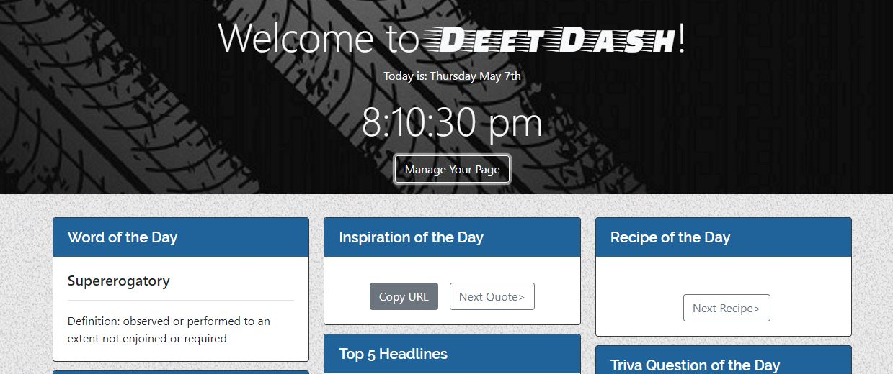

---
## Background :
Deet-Dash is a customizable dashboard web application that utilizes several 3rd party API's in order to deliver various forms of information to the user using cards. The user is able to customize what cards are visible to them using a module and the changes are stored as JSON in local Storage.

```
User Stories: 

1: Name/Date/Time (moment.js)
    - AS A user 
    - I WANT To know know the date/time
    - SO THAT I can figure out what day it is

2: Weather Card (Open Weather Map API)
    - AS A user 
    - I WANT To know the weather
    - SO THAT I know what to wear

3: Joke of the Day Card (Rapid API: SlapBotAPI)
    - AS A user 
    - I WANT To know a joke of the day
    - SO THAT I can make friends happy

4: This Day in History (history.muffinlabs.com API)
    - As a user
    - I WANT To know a bit of history
    - So THAT I can know more about history
```
---
## Technologies :
- Jquery (JavaScript)
- html (Framework)
- FlexBox/Bootstrap (CSS)

### APIs
* moment.js - Date and Time information
* Merriam-Webster Ditionary API - Word of the Day
* Open Weather Map API - Weather
* Rapid API: SlapBotAPI - Joke of the Day
* history.muffinlabs.com - This Day in History
* Universal Inspiarational Quotes API- Inspiration of the Day
* New York Times API- Top 5 Headlines
* Rapid API: Spoonacular Recipe-Food-Nutrition API - Recipe of the Day
* Open Trivia DB - Trivia of the Day

